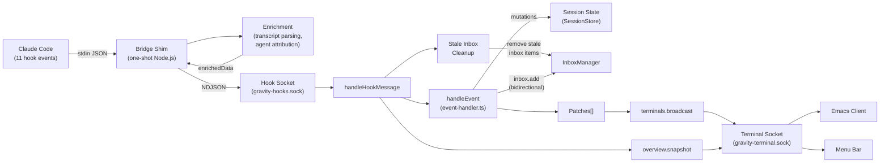
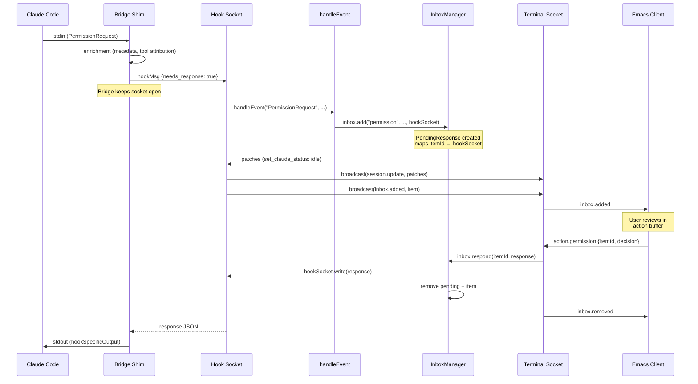
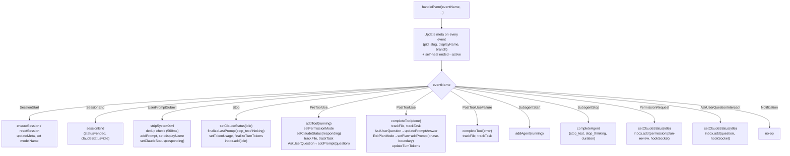

# Event Handling End-to-End — Mermaid Diagrams

Generated from code analysis of gravity-server's event handling pipeline.

---

## Diagram 1: Event Handling Overview

The fire-and-forget path: Claude Code fires a hook, the bridge enriches the data, forwards it to the server's hook socket, the event handler mutates session state and produces patches, and those patches are broadcast to all connected terminals.

---

## Diagram 2: Bidirectional Flow (PermissionRequest / AskUserQuestion)

The bidirectional path where the bridge keeps its connection open while the user responds in Emacs. The `InboxManager` holds the `PendingResponse` mapping the inbox item to the bridge's hook socket. When a terminal responds, the server writes back to the bridge, which writes to stdout for Claude Code.

---

## Diagram 3: Event Handler Switch — Per-Event State Mutations

What each event type does to session state. Every event first updates meta and self-heals ended sessions, then dispatches to event-specific logic.

---

## Source Files

| Entity | File |
|--------|------|
| Bridge shim entry | `packages/emacs-bridge/src/index.ts` |
| Enrichment functions | `packages/emacs-bridge/src/enrich.ts` |
| Hook/terminal socket setup | `packages/gravity-server/src/gravity-server.ts` |
| `handleHookMessage` | `packages/gravity-server/src/gravity-server.ts:93` |
| `handleEvent` (event handler switch) | `packages/gravity-server/src/handlers/event-handler.ts:135` |
| `handleTerminalMessage` | `packages/gravity-server/src/gravity-server.ts:264` |
| `InboxManager` | `packages/gravity-server/src/state/inbox.ts:14` |
| `TerminalServer` | `packages/gravity-server/src/protocol/terminal-server.ts` |
| Session mutations | `packages/gravity-server/src/state/session.ts` |
| `SessionStore` | `packages/gravity-server/src/state/session-store.ts` |
